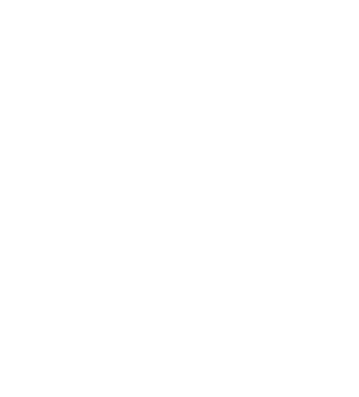

# Pacman Game in Java

A graphical 2D Pacman game built with Java's native AWT and Swing rendering libraries.



## Features

- **Interactive Gameplay**: Control Pacman using keyboard arrow keys to navigate the maze.
- **Dynamic Entities (Ghosts)**: Red, Pink, Orange, and Blue ghosts that move dynamically using pathing and collision rules.
- **Map Loader (Tilemap)**: Automatically parses a structured tilemap arrays to dynamically place walls, food pellets, ghosts, and Pacman.
- **Game Loop**: Controlled by a high-frequency Java Swing `Timer` to smoothly update game coordinates and redraw frames.
- **Collision Detection**: Handles interactions between Pacman, ghosts (lives/game-over states), walls, and food pellets (scoring system).

## Getting Started

### Prerequisites

- Java Development Kit (JDK) 8 or higher installed.

### Compilation and Execution

1. Open your terminal/command prompt and navigate to the project directory:
   ```bash
   cd pacman-java-master/pacman-java-master
   ```

2. Compile the Java source files:
   ```bash
   javac App.java PacMan.java
   ```

3. Run the application:
   ```bash
   java App
   ```

---

## MVC Architecture

This desktop Swing application is structured using a GUI-adapted version of the **Model-View-Controller (MVC)** design pattern:

```mermaid
graph TD
    subgraph Model [Model: Game State & Objects]
        State[Game State<br/>- score, lives, gameOver<br/>- tileMap / Grid Layout]
        Block[Block Entity Class<br/>- coordinates x, y<br/>- dimensions width, height<br/>- direction/speed vector]
    end

    subgraph View [View: PacMan Panel Drawing]
        Panel[PacMan Panel Class extends JPanel<br/>- paintComponent()<br/>- draw()]
        Images[Asset Loader<br/>- PacMan direction images<br/>- Ghost sprite sheets<br/>- Walls & Food icons]
    end

    subgraph Controller [Controller: KeyListener & Loop Timer]
        App[App Entry Class<br/>- JFrame wrapper]
        Loop[Swing Timer Game Loop<br/>- ActionEvent Handler<br/>- move() logic controller]
        Input[User Keyboard Inputs<br/>- KeyListener arrow keys]
    end

    %% Interactions
    Input -->|Captures arrow keys / updates direction| Block
    Loop -->|Calculates collision & movement| State
    State -->|Supplies grid & positions data| Panel
    Images -->|Feeds sprites| Panel
    Panel -->|Renders updated screen frame| View
    App -->|Initializes panel and window| Panel
```

### Components Breakdown:
- **Model (`Block` & Game State Variables)**: Encapsulates coordinates, sizes, velocities, map configurations, current scores, and remaining lives.
- **View (`PacMan` Painting Logic)**: Inherits from `JPanel` and overrides the rendering pipeline (`paintComponent()`) to draw the board, pellets, score overlays, and sprite animations.
- **Controller (`App`, `KeyListener`, and `Timer`)**: Coordinates keyboard event handling (`keyPressed()`), checks boundary collisions against walls, and ticks the game loop periodically using `javax.swing.Timer`.
